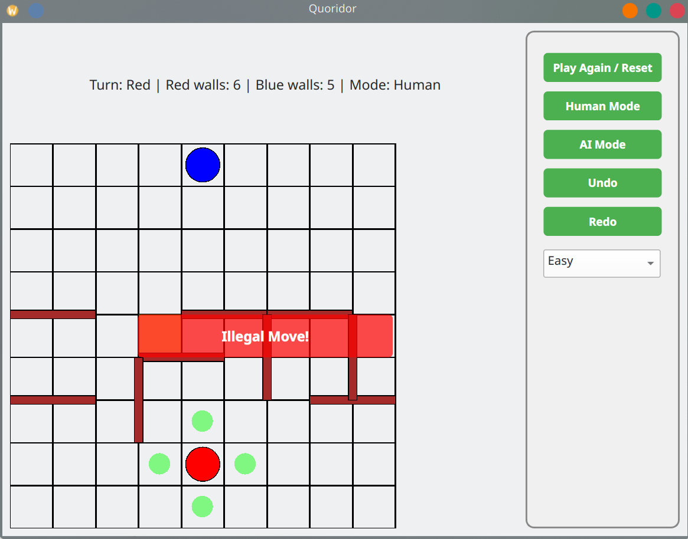

# Quoridor Arena

Quoridor Game with Human and AI modes. Play in the arena to be the winner!

## Features

- Two players: Human vs Human or Human vs AI
- AI with 3 difficulty levels: Easy, Medium, Hard
- Undo/Redo functionality
- Playable via GUI using PyQt6

---

## Installation

1.  **Clone the repository:**

    ```bash
    git clone "url"
    cd REPO_NAME
    ```

2.  **Create and activate a virtual environment:**

    ```bash
    python -m venv venv

    # Windows
    .\venv\Scripts\activate

    # Linux/Mac
    source venv/bin/activate
    ```

3.  **Install dependencies:**
    ```bash
    pip install -r requirements.txt
    ```

---

## Running the game

```bash
python main.py
```

`Make sure main.py launches your GameWindow.`

### Controls

- Click on a pawn to move or use arrow keys

- Right-click to place walls

- press H to change to Horizontal Orientation and V for vertical Orientation of <span style="color: yellow;">walls</span>

- Use the side panel to reset the game or switch modes

### Rules

- first to reach the last row wins

- <span style="color: red;">Orthogonal Moves Only</span> ( up , down , left , right )

- if pawn blocks a move then we can jump over him

- if wall blocks the jump is the only case we can move <span style="color: red;">Diagonal</span>

---

## Samples of GamePlay

### **<span style="color: red;">Change Orientation</span>**


### **<span style="color: red;">Winner</span>**


### **<span style="color: red;">Illegal Wall Placement</span>**


### **<span style="color: red;">Illegal Move</span>**



### **<span style="color: yellow;">Jump Move if Blocked ( Special Case ) </span>**


### **<span style="color: yellow;">Diagonal Move ( Special Case ) </span>**


## License

MIT License
