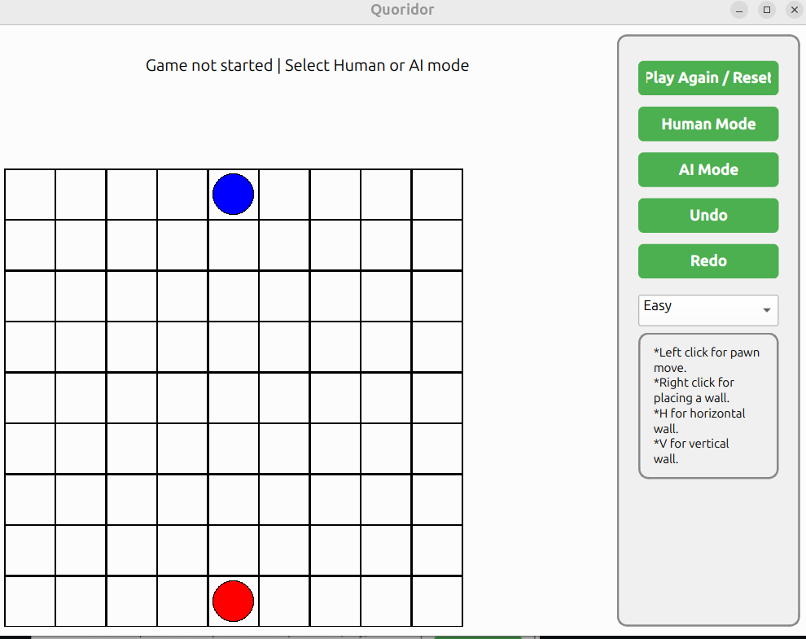
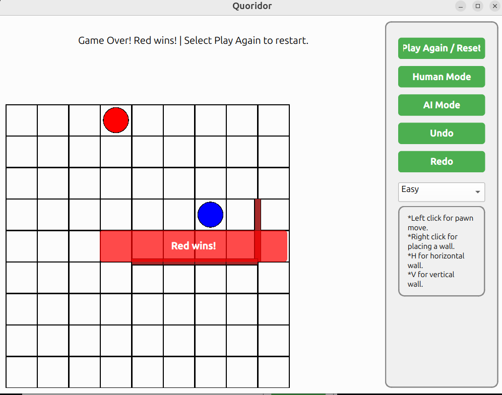
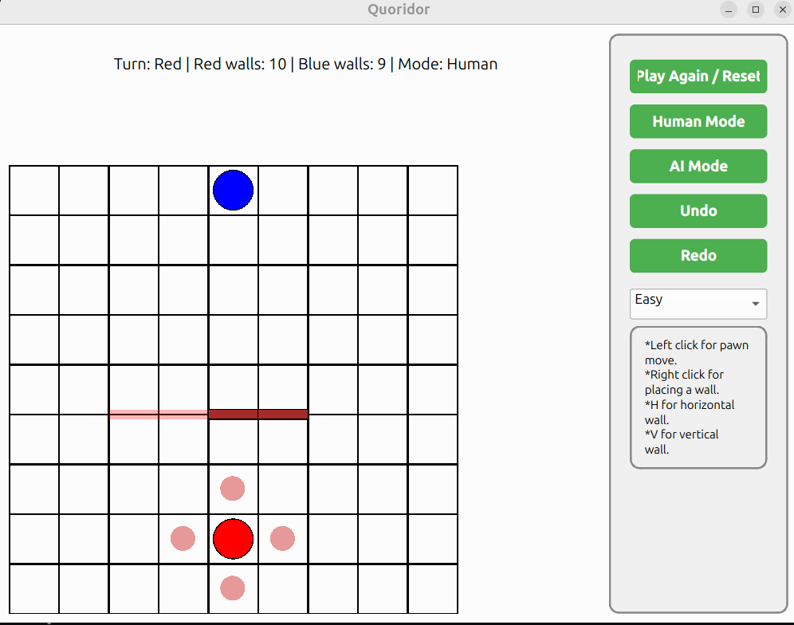
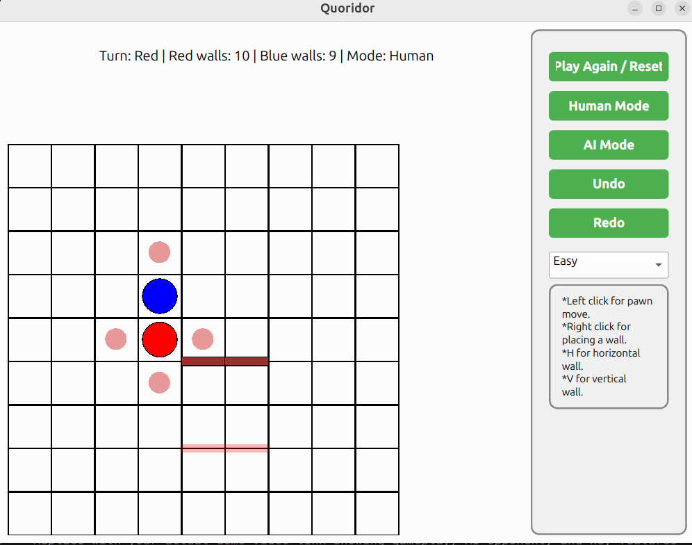
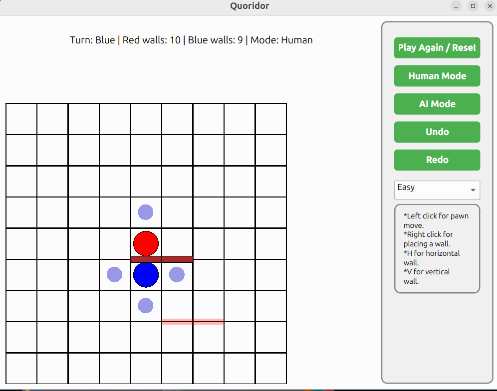
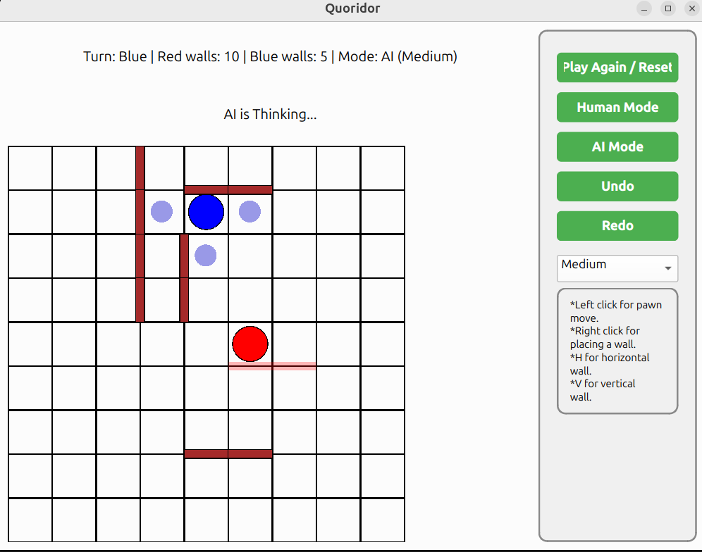

# Quoridor Arena

A Python implementation of the classic Quoridor board game featuring an intelligent AI opponent powered by the Minimax algorithm.

## Game Description

Quoridor is a two-player strategy board game where players race to reach the opposite side of a 9×9 grid while strategically placing walls to block their opponent's path. 

**Objective**: Be the first player to reach the opposite end of the board.

**Key Mechanics**:
- Each player has 10 walls to use throughout the game
- On each turn: either move your pawn OR place one wall
- Walls cannot completely block a player's path to their goal
- Players can jump over opponents or move diagonally in special cases

## Features

- **Human vs Human Mode**: Local two-player gameplay
- **Human vs AI Mode**: Play against intelligent computer opponent
- **Three Difficulty Levels**: Easy (depth 1), Medium (depth 2), Hard (depth 3)
- **AI Algorithm**: Minimax with BFS pathfinding and strategic heuristics
- **Undo/Redo**: Available in Human vs Human mode
- **Modern GUI**: Built with PyQt6

## Installation

1.  **Clone the repository:**

    ```bash
    git clone https://github.com/AhmedSaid3617/quoridor-game-ai.git
    cd quoridor-game-ai
    ```

2.  **Install dependencies:**
    ```bash
    pip install -r requirements.txt
    ```

    Requirements: Python 3.8+, PyQt6

## Running the Game

```bash
python main.py
```

## Controls

### Mouse Controls
- **Left-click**: Move pawn to highlighted legal position
- **Right-click**: Place wall at cursor position

### Keyboard Controls
- **H key**: Switch to Horizontal wall placement mode
- **V key**: Switch to Vertical wall placement mode

### Game Options
- **Mode Selection**: Choose Human or AI opponent
- **Difficulty**: Select Easy, Medium, or Hard (AI mode only)
- **Undo/Redo**: Reverse or restore moves (Human mode only)
- **Reset/Play Again**: Start a new game

---

## Screenshots

### **Game Board - Initial Setup**



### **Winner Announcement**



### **Wall Placement**



### **Special Moves**





### **AI Playing**


---

## Demo Video

🎥 **[Watch Demo Video Here](#)**

*Replace with your actual demo video link showing gameplay, AI opponent, and key features*

---

## Project Structure

```
quoridor-game-ai/
├── main.py                 # Entry point
├── requirements.txt        # Dependencies
├── src/
│   ├── agent/             # AI implementation (Minimax)
│   ├── controller/        # Game flow management
│   ├── gui/               # PyQt6 interface
│   ├── helpers/           # Pathfinding (BFS) and wall solver
│   ├── rules/             # Game rules engine
│   └── state/             # Game state representation
└── test/                  # Unit tests
```

## Technologies

- **Python 3.x**: Core language
- **PyQt6**: GUI framework
- **Minimax Algorithm**: AI decision-making
- **BFS Pathfinding**: Shortest path calculation
- **pytest**: Testing

---

## Documentation

For detailed information including AI algorithm explanation, design decisions, and implementation challenges, see [PROJECT_DOCUMENTATION.md](PROJECT_DOCUMENTATION.md).
